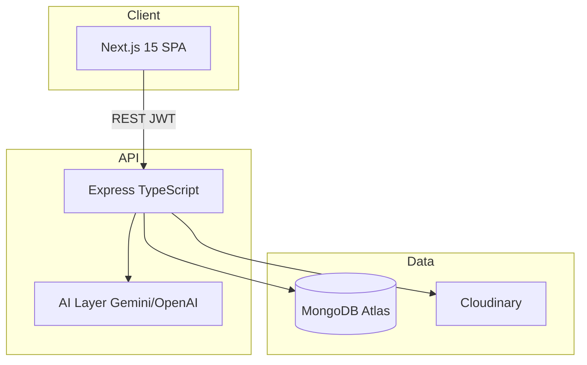

# Architecture

## Scalability (5,000+ users)

- Indexed queries on `role`, `departmentId`, `userId+date`, `jobId+aiScore`
- Pagination-ready list endpoints (`page`, `limit`)
- Stateless JWT — horizontal scale on Render/Heroku
- Rate limiting 500 req/15min per IP

## Security

- bcrypt password hashing
- JWT httpOnly cookies + Bearer header
- Helmet, CORS, mongo-sanitize, Zod validation
- Secrets via environment variables only
